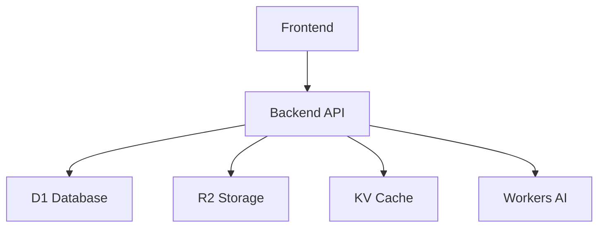

# TRADEAI Operations Runbook

## 📋 Table of Contents

1. [Overview](#overview)
2. [System Architecture](#system-architecture)
3. [Deployment Procedures](#deployment-procedures)
4. [Monitoring & Alerting](#monitoring--alerting)
5. [Incident Response](#incident-response)
6. [Maintenance Procedures](#maintenance-procedures)
7. [Backup & Recovery](#backup--recovery)
8. [Security Procedures](#security-procedures)
9. [Troubleshooting Guide](#troubleshooting-guide)
10. [Contact Information](#contact-information)

---

## Overview

### System Description
TRADEAI is a comprehensive trade promotion management platform built on Cloudflare's serverless infrastructure.

**Components:**
- **Frontend**: React SPA hosted on Cloudflare Pages
- **Backend**: Cloudflare Workers (Hono framework)
- **Database**: Cloudflare D1 (SQLite)
- **Storage**: Cloudflare R2
- **Cache**: Cloudflare KV
- **AI/ML**: Cloudflare Workers AI

### Key URLs
| Service | URL | Purpose |
|---------|-----|---------|
| Frontend | https://tradeai.vantax.co.za | Main application |
| Backend API | https://tradeai-api.vantax.workers.dev | REST API |
| Health Check | https://tradeai-api.vantax.workers.dev/health | System health |

### Support Contacts
- **On-Call Engineer**: See PagerDuty rotation
- **Slack Channel**: #tradeai-ops
- **GitHub**: https://github.com/Reshigan/TRADEAI

---

## System Architecture

### Infrastructure Diagram
```
┌─────────────────────────────────────────────────────────┐
│                    Cloudflare Edge                       │
├─────────────────────────────────────────────────────────┤
│  ┌─────────────┐         ┌─────────────┐               │
│  │   Pages     │         │   Workers   │               │
│  │  (Frontend) │────────▶│  (Backend)  │               │
│  └─────────────┘         └──────┬──────┘               │
│                                 │                       │
│         ┌───────────────────────┼───────────────────┐   │
│         │           │           │                   │   │
│    ┌────▼────┐ ┌────▼────┐ ┌───▼────┐      ┌──────▼──┐│
│    │   D1    │ │   R2    │ │   KV   │      │   AI    ││
│    │ (SQLite)│ │(Storage)│ │ (Cache)│      │  (ML)   ││
│    └─────────┘ └─────────┘ └────────┘      └─────────┘│
└─────────────────────────────────────────────────────────┘
```

### Service Dependencies


### Key Metrics
- **Target Uptime**: 99.9%
- **Max Response Time**: 500ms (p95)
- **Error Rate Target**: <0.1%
- **Deployment Frequency**: On-demand (CI/CD)

---

## Deployment Procedures

### Pre-Deployment Checklist

- [ ] All tests passing in CI
- [ ] Code review completed
- [ ] CHANGELOG updated
- [ ] Database migrations reviewed
- [ ] Rollback plan prepared
- [ ] Team notified of deployment
- [ ] Monitoring dashboards open

### Automated Deployment (CI/CD)

**Trigger**: Push to `main` branch

**Steps**:
1. GitHub Actions workflow starts automatically
2. Tests run (linting, unit, integration)
3. Backend deploys to Workers
4. Database migrations run
5. Frontend builds and deploys to Pages
6. Smoke tests verify deployment
7. Notification sent to Slack

**Workflow File**: `.github/workflows/deploy.yml`

### Manual Deployment

**When to Use**: Emergency hotfixes, CI/CD failure

**Steps**:
```bash
# 1. Ensure you're on main branch
git checkout main
git pull origin main

# 2. Run deployment script
chmod +x deploy.sh
./deploy.sh production

# 3. Verify deployment
curl https://tradeai-api.vantax.workers.dev/health
curl https://tradeai.vantax.co.za/health
```

### Database Migration

**When Required**: Schema changes, data migrations

**Steps**:
```bash
# 1. Review migration file
cat workers-backend/migrations/0070_*.sql

# 2. Backup database (if needed)
wrangler d1 execute tradeai --remote --output-json > backup.json

# 3. Run migration
wrangler d1 execute tradeai --remote --file migrations/0070_*.sql

# 4. Verify migration
wrangler d1 execute tradeai --remote --command "SELECT * FROM processes LIMIT 1"
```

### Rollback Procedure

**When to Use**: Critical bugs, performance degradation, data issues

**Steps**:
```bash
# 1. Identify last known good commit
git log --oneline -10

# 2. Revert to previous version
git revert HEAD
git push origin main

# 3. CI/CD will auto-deploy

# 4. For emergency rollback, use Wrangler
cd workers-backend
wrangler rollback

# 5. Verify rollback
curl https://tradeai-api.vantax.workers.dev/health
```

---

## Monitoring & Alerting

### Key Dashboards

1. **Cloudflare Analytics**
   - URL: https://dash.cloudflare.com/
   - Metrics: Requests, errors, bandwidth, cache hit rate

2. **Workers Analytics**
   - URL: https://dash.cloudflare.com/?to=/:account/workers-and-pages
   - Metrics: CPU time, memory, errors, duration

3. **D1 Analytics**
   - URL: https://dash.cloudflare.com/?to=/:account/d1
   - Metrics: Queries, read/write operations, storage

### Key Metrics to Monitor

| Metric | Warning | Critical | Alert Channel |
|--------|---------|----------|---------------|
| Error Rate | >1% | >5% | Slack + PagerDuty |
| Response Time (p95) | >500ms | >1000ms | Slack |
| Availability | <99.5% | <99% | Slack + PagerDuty |
| Database Errors | >10/hour | >50/hour | Slack |
| CPU Time (avg) | >50ms | >100ms | Slack |

### Alert Configuration

**Slack Alerts**:
- Channel: #tradeai-alerts
- Webhook: Configure in Cloudflare dashboard

**PagerDuty**:
- Service: TRADEAI Production
- Escalation: On-call engineer → Team lead → VP Engineering

### Health Checks

**Automated** (every 5 minutes):
```bash
curl -f https://tradeai-api.vantax.workers.dev/health
```

**Manual**:
```bash
# Full health check
curl https://tradeai-api.vantax.workers.dev/health | jq

# Database connectivity
curl -H "Authorization: Bearer TOKEN" \
  https://tradeai-api.vantax.workers.dev/api/processes
```

---

## Incident Response

### Severity Levels

| Severity | Description | Response Time | Resolution Time |
|----------|-------------|---------------|-----------------|
| P0 - Critical | Complete outage | 15 minutes | 2 hours |
| P1 - High | Major feature broken | 1 hour | 8 hours |
| P2 - Medium | Minor feature broken | 4 hours | 24 hours |
| P3 - Low | Cosmetic issue | 24 hours | 1 week |

### Incident Response Process

**1. Detection**
- Automated alerts
- User reports
- Monitoring dashboards

**2. Triage**
- Assess severity
- Identify affected services
- Notify stakeholders

**3. Response**
- Assign incident commander
- Open incident channel (#tradeai-incidents)
- Start incident log

**4. Resolution**
- Implement fix or rollback
- Verify resolution
- Monitor for recurrence

**5. Post-Mortem**
- Document root cause
- Create action items
- Schedule follow-up

### Communication Templates

**Initial Notification**:
```
🚨 INCIDENT ALERT 🚨

Severity: P0/P1/P2
Service: [Service Name]
Impact: [Description of impact]
Started: [Time]
Status: Investigating

Next update in 30 minutes.
```

**Resolution Notification**:
```
✅ INCIDENT RESOLVED ✅

Service: [Service Name]
Duration: [X hours Y minutes]
Root Cause: [Brief description]
Resolution: [Brief description]

Post-mortem scheduled for [Date].
```

---

## Maintenance Procedures

### Scheduled Maintenance

**Frequency**: Monthly (first Sunday, 2-4 AM UTC)

**Activities**:
- Database optimization
- Log rotation
- Dependency updates
- Security patches

**Procedure**:
1. Announce maintenance 1 week in advance
2. Enable maintenance mode (if needed)
3. Perform maintenance tasks
4. Verify system health
5. Disable maintenance mode
6. Send completion notification

### Database Maintenance

**Weekly**:
```sql
-- Analyze tables for query optimization
PRAGMA optimize;

-- Check database integrity
PRAGMA integrity_check;
```

**Monthly**:
```sql
-- Vacuum database to reclaim space
VACUUM;

-- Review slow queries
SELECT * FROM query_logs WHERE duration > 1000;
```

### Dependency Updates

**Process**:
1. Review Dependabot PRs
2. Test in staging environment
3. Update CHANGELOG
4. Deploy with regular release

**Critical Security Updates**:
- Deploy within 24 hours
- Skip staging if critical
- Monitor closely after deployment

---

## Backup & Recovery

### Backup Strategy

**Database (D1)**:
- Automatic daily backups by Cloudflare
- Retention: 30 days
- Manual backups before migrations

**Storage (R2)**:
- Versioning enabled
- Cross-region replication
- Lifecycle policies for old files

**Configuration**:
- All config in Git
- Secrets in Cloudflare Secrets
- Environment variables documented

### Backup Procedures

**Manual Database Backup**:
```bash
# Export database
wrangler d1 execute tradeai --remote --output-json > backup-$(date +%Y%m%d).json

# Upload to R2 for safekeeping
wrangler r2 object put backups/backup-$(date +%Y%m%d).json --file backup-$(date +%Y%m%d).json
```

### Recovery Procedures

**Database Recovery**:
```bash
# 1. Identify backup to restore
wrangler r2 object get backups/backup-YYYYMMDD.json > restore.json

# 2. Import backup
wrangler d1 execute tradeai --remote --input-json restore.json

# 3. Verify recovery
wrangler d1 execute tradeai --remote --command "SELECT COUNT(*) FROM processes"
```

**Full System Recovery**:
1. Restore database from backup
2. Redeploy Workers
3. Redeploy Pages
4. Verify all endpoints
5. Run smoke tests
6. Notify stakeholders

---

## Security Procedures

### Access Management

**Principle of Least Privilege**:
- Developers: Read-only production access
- DevOps: Full access with approval
- On-call: Emergency access with audit

**Access Review**: Quarterly

### Security Monitoring

**Daily Checks**:
- Failed login attempts
- Unusual API patterns
- Error rate spikes
- Geographic anomalies

**Weekly Reviews**:
- Access logs
- Permission changes
- Security alerts
- Dependency vulnerabilities

### Incident Response (Security)

**Data Breach**:
1. Contain breach (revoke access, block IPs)
2. Assess scope
3. Notify legal/compliance
4. Notify affected users (if required)
5. Document and remediate

**DDoS Attack**:
1. Enable Cloudflare Under Attack mode
2. Review traffic patterns
3. Implement rate limiting
4. Contact Cloudflare support if needed

---

## Troubleshooting Guide

### Common Issues

#### 1. High Error Rate

**Symptoms**: Error rate >5%

**Diagnosis**:
```bash
# Check error logs
wrangler tail --status error

# Check recent deployments
git log --oneline -5

# Check database connectivity
curl https://tradeai-api.vantax.workers.dev/health
```

**Resolution**:
1. Identify error source in logs
2. Check recent changes
3. Rollback if needed
4. Fix and redeploy

#### 2. Slow Response Times

**Symptoms**: p95 >1000ms

**Diagnosis**:
```bash
# Check Workers CPU time
# In Cloudflare dashboard: Workers > Analytics

# Check database queries
wrangler d1 execute tradeai --remote --command "SELECT * FROM query_logs ORDER BY duration DESC LIMIT 10"

# Check for slow endpoints
# Review analytics by route
```

**Resolution**:
1. Identify slow queries
2. Add indexes if needed
3. Optimize queries
4. Consider caching

#### 3. Database Connection Issues

**Symptoms**: Database timeouts, connection errors

**Diagnosis**:
```bash
# Check database status
wrangler d1 info tradeai

# Test connectivity
wrangler d1 execute tradeai --remote --command "SELECT 1"

# Check for locks
wrangler d1 execute tradeai --remote --command "PRAGMA locking_mode"
```

**Resolution**:
1. Restart worker (redeploy)
2. Check for long-running queries
3. Optimize queries
4. Contact Cloudflare support if persistent

#### 4. Frontend Build Failures

**Symptoms**: CI/CD fails on build step

**Diagnosis**:
```bash
cd frontend
npm ci
npm run build
# Check for specific errors
```

**Resolution**:
1. Fix TypeScript/ESLint errors
2. Update dependencies
3. Clear cache: `rm -rf node_modules dist`
4. Rebuild

#### 5. API Authentication Failures

**Symptoms**: 401/403 errors

**Diagnosis**:
```bash
# Check token validity
# Verify JWT expiration
# Check authentication middleware logs
```

**Resolution**:
1. Verify token generation
2. Check clock skew
3. Review auth middleware
4. Update tokens if expired

### Escalation Path

**Level 1**: On-call engineer
- Triage and initial diagnosis
- Apply known fixes
- Escalate if unresolved in 30 minutes

**Level 2**: Senior engineer
- Deep dive investigation
- Coordinate with team
- Escalate if infrastructure issue

**Level 3**: Cloudflare support
- Open support ticket
- Provide diagnostic information
- Follow up until resolution

---

## Contact Information

### Internal Contacts

| Role | Name | Contact | Escalation |
|------|------|---------|------------|
| On-Call | See PagerDuty | PagerDuty | Automatic |
| DevOps Lead | [Name] | Slack/Email | Level 2 |
| Engineering VP | [Name] | Slack/Email | Level 3 |

### External Contacts

| Service | Support | SLA | Contact |
|---------|---------|-----|---------|
| Cloudflare | Enterprise | 1 hour | support.cloudflare.com |
| GitHub | Standard | 24 hours | support.github.com |

### Documentation Links

- **GitHub Repo**: https://github.com/Reshigan/TRADEAI
- **Cloudflare Dashboard**: https://dash.cloudflare.com/
- **Monitoring**: [Link to your monitoring tool]
- **Incident Log**: [Link to your incident management tool]

---

## Appendix

### A. Useful Commands

```bash
# Check worker status
wrangler whoami

# View worker logs
wrangler tail

# Check D1 database
wrangler d1 info tradeai

# Execute D1 query
wrangler d1 execute tradeai --remote --command "SELECT * FROM processes LIMIT 5"

# Deploy worker
wrangler deploy

# Deploy pages
wrangler pages deploy dist --project-name=tradeai

# Check deployment status
wrangler deployments list

# Rollback deployment
wrangler rollback
```

### B. Environment Variables

| Variable | Description | Default |
|----------|-------------|---------|
| `REACT_APP_API_URL` | Backend API URL | https://tradeai-api.vantax.workers.dev |
| `REACT_APP_WS_URL` | WebSocket URL | wss://tradeai-api.vantax.workers.dev/ws |
| `CLOUDFLARE_API_TOKEN` | API token for deployments | (secret) |
| `CLOUDFLARE_ACCOUNT_ID` | Account ID | (secret) |

### C. Runbook Updates

This runbook should be updated:
- After each major incident
- When new features are deployed
- Quarterly review minimum
- When team structure changes

**Last Updated**: [Current Date]
**Next Review**: [Date + 3 months]
**Owner**: DevOps Team

---

*End of Runbook*
